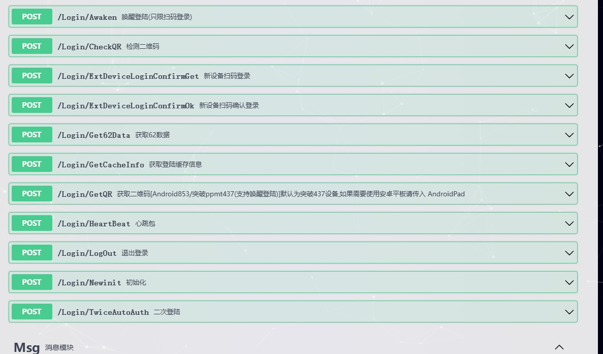
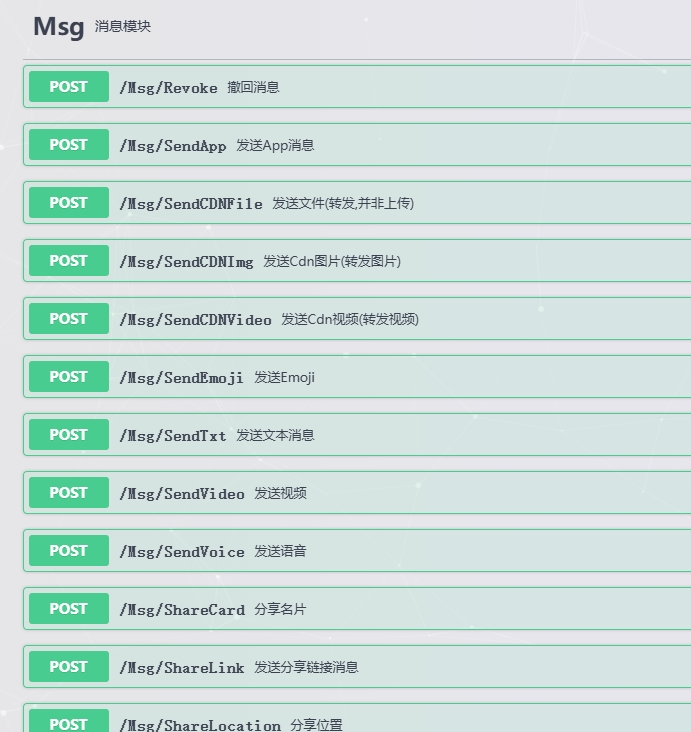

# 🔥WeChat-Protocol: 高可读性微信协议 SDK

**项目定位：**  本仓库提供一套**代码可读性高**的微信协议 SDK，旨在为开发者提供学习和测试的平台。

**支持平台：** Mac  / iPad / Windows

**📱核心功能：**

* **账号管理：**
    * 扫码/密码登录
    * 多账号管理
* **消息处理：**
    * 消息防撤回
    * 消息转发
    * 群发消息
    * 定时发送
    * 智能回复 (基础)
* **通讯功能：**
    * 文本/图片/语音/视频/文件/名片 消息收发
    * 发送群消息
    * 添加好友
。。更多

**部署指南：**

* 提供简易部署方案一键部署

**版本信息：**

* **源码版：** (2000)  提供完整源代码，包含部署指导。
* **服务版：** (价格面议)  提供专业技术托管和持续维护，功能可定制。
 
**📞 联系方式：**

* Telegram: [@Geminipro1](https://t.me/Geminipro1)  (请备注来意)

**演示截图：**

**关键词：** 微信协议, SDK, 微信机器人, 协议源码, 消息转发, 自动化
